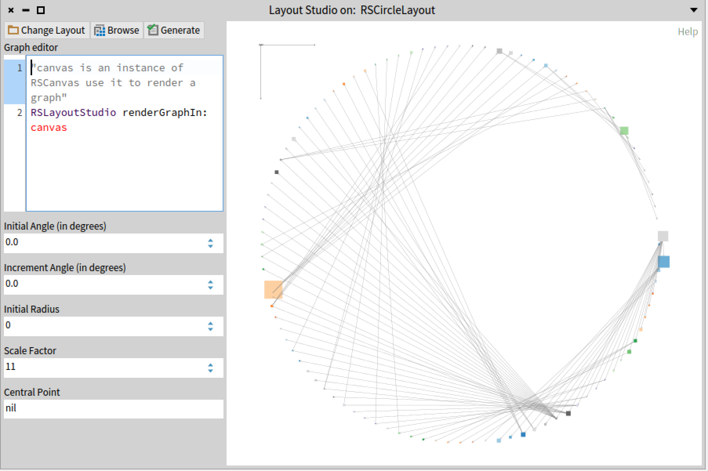
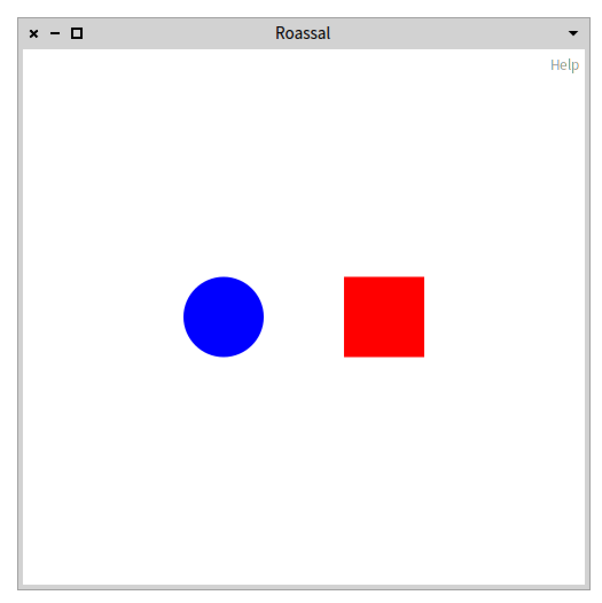
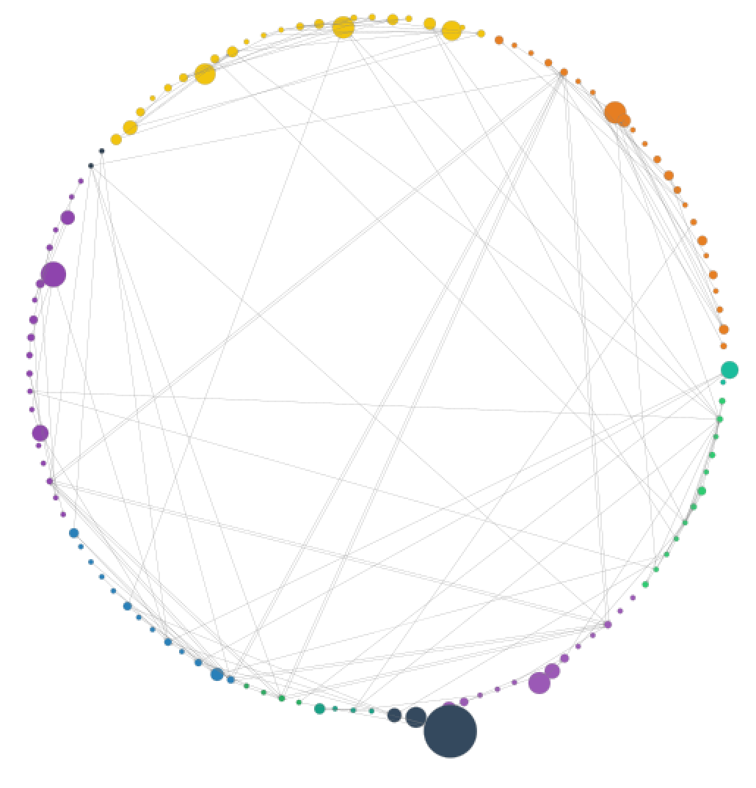

<!-- headingDivider: 1 -->
<!-- paginate: true -->
<!-- footer: "Roassal 3" -->

# Nour Jihene Agouf: Ph.D. Student
Company & Team Lab: Arolla & RMoD/Evref
Contact email: nour-jihene.agouf@inria.fr
Website: www.nouragouf.fr


# First fun steps with Roassal

- In the Pharo environment
- Data visualization
- A set of tools


```smalltalk
"Animations"
RSAnimationExamples new example24RoassalPerlinNoise open extent: 800@500.
RSAnimationExamples new example09PerlinParticles open extent: 800@500.
"Charts"
RSChartExample new example24SpineLine open.
RSKiviatExample new example06Chemistry open.
"Images"
RSSVGAnimationExamples new example02Miku open.
"System complexity"
MySystemComplexity new example open extent: 900@600
```

# Roassal Examples (`RSExamplesBrowser`)

#


#


# Roassal Layouts (`RSLayoutStudio`)

#

# Roassal - Main components

- **Canvas**
- **Shapes**
- **Layouts**
- **Color Palettes**
- **Normalizer**
- **Links**
- **Interactions**
- **Events**


# The canvas

- Contains and displays shapes
- The origine (0@0) is located at the center
```smalltalk
canvas := RSCanvas new.
canvas open
```


# Shapes
- Subclasses of `RSShape`
  - Rectangle : `RSBox`
  - Cercle : `RSCircle`
  - Ligne : `RSLine`
  - Texte : `RSLabel`
  - etc.

# Shapes
- Rectangle
```smalltalk
rect := RSBox new.

```


- Cercle
```smalltalk
circle := RSCircle new.

```


# Edit the shapes

Properties : `#height:`, `#width:`, `#size:`, `#color:`, `#border:`, `#borderColor:`
```smalltalk
rect height: 50;
     width: 100;
     color: Color red;
     border: RSBorder new.
```


# Shapes
- Associate a user data to a shape (model)
  - A shape can represent a Pharo object
  - Actions to a shape according to the represented object
```smalltalk
shape model: 1
```

# Shapes in the canvas
```smalltalk
canvas add: rect.
canvas add: circle.
"canvas addAll: {rect . circle}"
canvas open
```


# Application
For every method of the package `Roassal3-Builders` classes, create a circle that describes it.
The result must be a set of shapes.
Add these shapes to a canvas and open the canvas.

# Layouts
Allows to manage the disposition of these objects in the canvas.
The subclasses of the class `RSLayout` :
  - Horizontal display `RSHorizontalLineLayout`
  - Vertical display `RSVerticalLineLayout`
  - Hierarchical display `RSTreeLayout`
  - Circular display `RSCircleLayout`
  - etc.
```smalltalk
RSAnimationExamples new example33AnimatedLayout open
```

# Layouts
- Horizontal display `RSHorizontalLineLayout`
```smalltalk
RSHorizontalLineLayout on: {circle . rect}.
canvas add: circle;
  add: rect.
canvas open
```




# Application
- Add a layout to the canvas shapes.


# Color Palettes
- Subclasses of the `RSColorPalette` class
- Offers multiple palettes
  - `RSDivergingColorPalette`, `RSQualitativeColorPalette`, `RSSequentialColorPalette`


# Application
- Attribute to each class a color describing it.
- Color each methods shape according to its class (methods of the same class must have the same color)
  - To do so, select a color palette with the same number of classes.


# Normalizer
- is a common task in various computer graphics and pattern recognition applications. It aims to normalize different objects into a canonical coordinate frame in order to guarantee a unique representation

# Normalizer
*Example*:
```Smalltalk

c := RSCanvas new.

(30 to: 100 by: 5) do: [ :nb |
	c add: (RSEllipse new size: nb; model: nb) ].

RSNormalizer size
	shapes: c shapes;
	normalize: #yourself.

RSNormalizer color
	shapes: c shapes;
	normalize: #yourself.
RSFlowLayout on: c shapes.
c shapes @ RSPopup.
c @ RSCanvasController
```

# Application
- Normalize the shape of each method according to its number of lines of code.


# Links
- Links shapes
```smalltalk
line := RSLine new.
line from: rect;
  to: circle.
canvas add: line.
```


# Links
- With a different attachment point
```smalltalk
line := RSLine new.
line withBorderAttachPoint;
  from: rect;
  to: circle.
canvas add: line.
```


# Links
- With a builder
```smalltalk
RSLineBuilder line
  canvas: c;
  connectFrom: [ :model | ].
```


# Application
- Connect methods that call each other



# Interactions
Subclasses of the class `RSInteraction` :
- Draggable `RSDraggable`
- Popup `RSPopup`
- Highlight `RSHighlightable`
- Menu `RSMenuActivable`
- etc.

```smalltalk
shape @ RSPopup "Display the name of the model when a mouse hover"
```

# Application
Add an interaction to the methods shapes:
- Make all shapes draggable.
- Create a popup when a mouse hover the shape that displays the name of the method class, the method name, number of lines of code, and the number of senders.


# Events

- Subclasses of the class `RSEvent`.
  - `RSMouseClick`, `RSMouseEnter`, `RSKeyDown`, etc.
```smalltalk
shape on: RSEvent do: [ :evt | "Action à réaliser" ]
```
# Application

- Add events to each shape, allowing to inspect the method when a mouse click.
- Color the metdhod and its senders in red when a mouse hover.
- Revert when mouse leaves the shape.

# Some Roassal tools


- Exporters (pdf, svg, png, ...)
```smalltalk
RSPNGExporter new
		canvas: self;
    filname: 'myCanvas';
    export
```

# Application
- Color edges the same as their sources.

- Add a green border for abstract methods.


# Ressources

- Github (MIT)
  - https://github.com/ObjectProfile/Roassal3
- Documentation
  - https://github.com/ObjectProfile/Roassal3Documentation
- Exporters
  - https://github.com/ObjectProfile/Roassal3Exporters
- Agile Visualization
  - http://agilevisualization.com/
